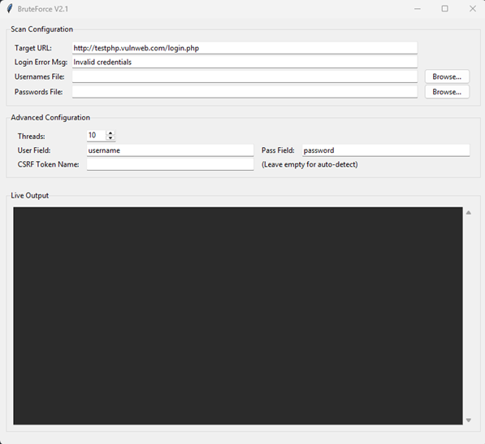

# BruteForce
<div align="center">
  
  
  
</div>

## No History
Always want to make my very own brutefoce tool

-----

A high-performance, multi-threaded login form weakness scanner with a user-friendly graphical interface (GUI). This tool is designed for penetration testers and security professionals to efficiently test web application login forms for weak credentials.

<p align="center">
  
  <br>
  <i>Main application interface</i>
  <em>BruteForce</em>
</p>


[Your Screenshot Here]
(It is highly recommended to add a screenshot of the GUI in action here. You can do this on GitHub by uploading an image to your repository and linking it.)
Example: 

## Description
This tool automates the process of brute-forcing login forms by testing a list of usernames against a list of passwords. It is built with performance and flexibility in mind, utilizing concurrent threads to significantly speed up the scanning process. Its Tkinter-based GUI makes it easy to configure and run on Windows, macOS, and Linux without needing to modify the code.

The scanner is smart enough to auto-detect common CSRF (Cross-Site Request Forgery) tokens and include them in each request, bypassing a common layer of protection. Scan results, including any found credentials, can be exported into professional, easy-to-read reports in HTML, CSV, or TXT formats.

## Key Features
**High-Speed, Multi-threaded Scanning:** Utilizes a thread pool to run many login attempts concurrently, drastically reducing scan times.

**Full Graphical User Interface (GUI):** An intuitive interface built with Tkinter for easy configuration and operation across all major operating systems.

**Username & Password List Support:** Test a list of multiple usernames against a comprehensive password dictionary.

**Automatic CSRF Token Detection:** Intelligently finds and uses CSRF tokens from the login page, allowing it to work on more secure sites.

- **Advanced Customization**
  - Specify the form field names for the username, password, and CSRF token.

  - Adjust the number of concurrent threads to match your network capabilities.

  - Define the specific error message that indicates a failed login attempt.

- **Professional Reporting:** Generate clean, shareable reports of the scan results in three different formats:

  - **HTML:** A polished, detailed report perfect for clients or management.

  - **CSV:** Easily import results into a spreadsheet for further analysis.

  - **TXT:** A simple, clean summary for quick reference.

- **Real-time Controls:** Start and stop scans at any time directly from the GUI.

## Requirements
The tool is built with Python 3. You will need the following libraries:
```bash
requests
```
```bash
beautifulsoup4
```
## Installation
Clone the repository:
```bash
git clone [your-repository-url]
cd [your-repository-folder]
```
Install the required libraries using pip:
```bash
pip install -r requirements.txt
```
 Or, install them manually:
```bash
pip install requests beautifulsoup4
```

## How to Use
Run the script from your terminal:
```bash
python login_weakness_scanner.py
```
Configure the Scan:

  - **Target URL:** The full URL of the page containing the login form.

  - **Login Error Msg:** The exact text that appears on the page only when a login attempt fails (e.g., "Invalid credentials", "Wrong username or password"). This is case-sensitive.

  - **Usernames File:** Click "Browse..." to select a .txt file containing one username per line.

  - **Passwords File:** Click "Browse..." to select a .txt file containing one password per line.

Advanced Configuration (Optional):

- **Threads:** Set the number of concurrent login attempts. A higher number is faster but may be blocked by firewalls. Start with 10-20.

- **User/Pass Field:** The **name** attribute of the username and password **< input >** fields in the HTML form. The tool pre-fills common names like **username** and **password**, but you can change them if the target uses something different (e.g., **user**, **pass**, **email**).

- **CSRF Token Name:** Leave this empty for auto-detection. If the tool fails to find the token, you can manually specify its **name** attribute here.

Start the Scan:

-  Click the **"Start Scan"** button.

-  The "Live Output" window will show real-time progress, including each attempt and any errors or successful finds.

Export the Report:

-  Once the scan is complete or stopped, the **"Export Report"** button will become active.

-  Click it and choose a location and format (HTML, CSV, or TXT) to save the results.

## Ethical Disclaimer
This tool is intended for educational purposes and for authorized security testing on systems where you have explicit permission. Using this tool on any system without consent is illegal and unethical. The developer assumes no liability and is not responsible for any misuse or damage caused by this program. Always act responsibly and ethically.

## License
This project is licensed under the MIT License - see the LICENSE file for details.

## Acknowledgments
Original concept by a lot of people around.

Refactoring and enhancements by lgp.
